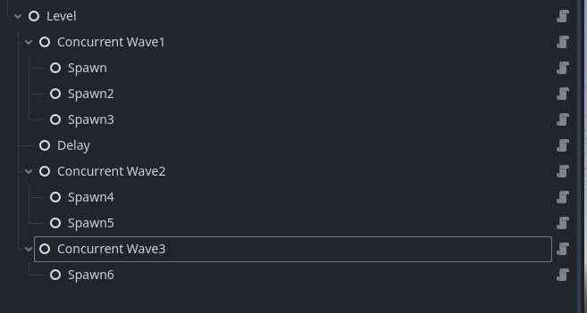

### Navigation

[Back to README](../README.md)

- [Docs](./Docs.md)
  - [Level Editor](./LevelEditor.md)
    - [Level Events](./LevelEvents.md)
  - [Concepts](./Concepts.md)

# Level Events

Level Events control the behavior of levels. Each event will run until it's completed it's task, and
all of it's children have completed their tasks.

Level Events can be customized in the Godot Editor be creating nodes for the events.

In the example above the level node will spawn each wave in sequence, with a delay between wave 1 
and 2. It will happen in the following order.

1. Wave 1 will spawn
  - Spawn, Spawn2, and Spawn3 will happen at the same time
2. There will be a short delay
3. Wave 2 will spawn
  - Spawn4 and Spawn5 will happen at the same time
4. Wave 5 will spawn
  -Spawn 6 will happen by itself.

After an event finishes it will notify it's parent event that it's finished, and the parent will
decide what to do next based on what kind of event it is.

# Level Event Nodes

Levels are described with Event Nodes that can be customized in the Godot editor. Here are a list of 
level event nodes and how they work.

## Level Node

Runs each of it's children in sequence. After each child finishes it will run the 
next. Finishes when all of it's children have finished.

## Sequence Node

Runs each of it's children node in sequence, delaying the next node until the previous one finishes.
Finishes when all of it's children have run and finished.

### Variables

| Variable | Description |
| - | - |
| delayPerSpawn | The amount of time to delay between each spawn |

## Concurrent Node

Runs each of it's child nodes at the same time. If delay per spawn is set then an automatic delay 
will be inserted between spawns. Finishes when all of it's children have 
finished.

### Variables

| Variable | Description |
| - | - |
| delayPerSpawn | The amount of time to delay between each concurrent spawn |

## Delay Node

Will delay by the amount of time specified, and then will run it's children. Finishes when all it's 
children have finished.

| Variable | Description |
| - | - |
| delay | The amount of time to wait before it's children get spawned |

## Spawn Node

Will spawn the specified prefab. Will finish when that prefab gets destroyed.

| Variable | Description |
| - | - |
| prefab | The prefab this will spawn |